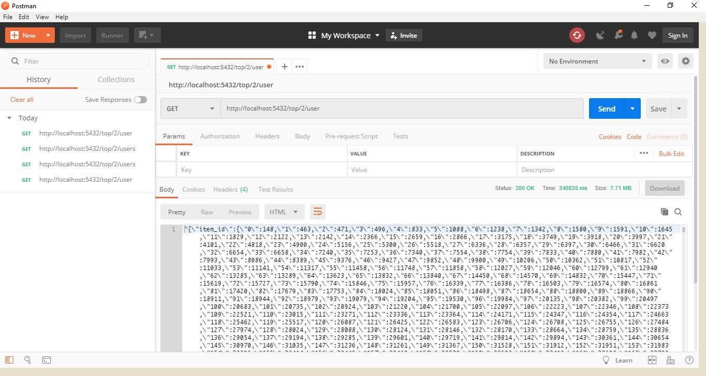

## Epinions items REST-API

REST API dapat digunakan untuk mencari sejumlah item yang direkomendasikan untuk setiap user_id dan juga sejumlah pengguna yang direkomendasikan untuk setiap item_id. Jumlah ditentukan pada setiap request pada API 

## End point
Pada setiap end point client hanya perlu memasukkan sejumlah bilangan bulat pada bagian `(int)` end point
### `http://IP:5432/top/(int)/items`
Mengembalikan sejumlah `(int)` item yang direkomendasikan untuk setiap user yang ada pada dataset.  

Hasil lebih lengkap dapat dilihat pada file [response1.html](response/response1.html)  
### `http://IP:5432/top/(int)/user`
Mengembalikan sejumlah `(int)` user yang direkomendasikan untuk setiap item yang ada pada dataset.  

Hasil lebih lengkap dapat dilihat pada file [response2.html](response/response2.html)